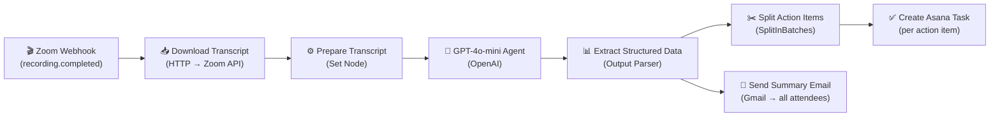

# 🧠 AI Meeting Intelligence Agent

Transform any meeting transcript into structured action items, decisions, summaries, and ready-to-send follow-up emails — powered by GPT-4o-mini.

> 🔗 **[n8n Workflow](https://aravind5.app.n8n.cloud/workflow/Cx9MxtPVrrYPUTYC)**

---

## How It Works

The n8n workflow automatically processes Zoom recordings and routes outputs to Asana and Gmail:



### Processing Pipeline

| Stage | Node | Output |
|---|---|---|
| Webhook trigger | Zoom Webhook | Raw recording event |
| Transcript fetch | HTTP Request → Zoom API | VTT/plain transcript |
| Prompt preparation | Set | Formatted prompt string |
| AI extraction | OpenAI GPT-4o-mini | JSON with action items, decisions, summary |
| Task creation | Asana (loop per item) | Individual Asana tasks with owners & due dates |
| Email dispatch | Gmail | Formatted summary email to all attendees |

---

## Action Item Extraction Schema

The AI returns a structured JSON object:

```json
{
  "action_items": [
    {
      "task": "Description of the task",
      "owner": "Person responsible",
      "due_date": "YYYY-MM-DD",
      "priority": "high | medium | low"
    }
  ],
  "decisions": ["List of decisions made during the meeting"],
  "summary": "2-3 paragraph plain-English summary",
  "email_subject": "Re: [Meeting Title] — Action Items & Summary",
  "email_body": "Full email body ready to send",
  "meeting_sentiment": "productive | neutral | tense"
}
```

---

## Setup

### 1. Add your OpenAI API Key

In the **Analyze Meeting** tab, paste your OpenAI API key in the password field. The key is never stored or logged.

For the n8n workflow, add your key as an n8n credential:
- Credential type: **OpenAI API**
- Name: `OpenAI account`

### 2. Required n8n Credentials

| Credential | Type | Used For |
|---|---|---|
| Zoom credentials | OAuth2 | Downloading transcripts from recordings |
| Asana credentials | OAuth2 | Creating tasks from action items |
| Gmail credential | OAuth2 | Sending summary emails to attendees |
| OpenAI API key | API Key | GPT-4o-mini inference |

### 3. n8n Placeholders to Configure

- **Zoom App Client ID / Secret** — from your Zoom Marketplace app
- **Asana Workspace ID** — found in your Asana URL (`app.asana.com/0/<WORKSPACE_ID>/`)
- **Asana Project ID** — the destination project for meeting tasks
- **Gmail sender address** — the authenticated Gmail account
- **Meeting series config** — map Zoom meeting IDs to attendee email lists
- **Webhook URL** — paste the n8n webhook URL into your Zoom app's Event Subscriptions

---

## Local Development

```bash
# Clone and install
git clone https://huggingface.co/spaces/Darkweb007/ai-meeting-intelligence
cd ai-meeting-intelligence
pip install -r requirements.txt

# Set your API key (optional — demo tab works without it)
export OPENAI_API_KEY="sk-..."

# Run
python app.py
# Open http://localhost:7860
```

---

## Features

- **Live Demo tab** — 4 pre-computed scenarios, no API key required
- **Analyze Meeting tab** — paste any transcript, get instant structured output
- **How It Works tab** — full n8n workflow documentation
- GPT-4o-mini for fast, cost-effective extraction (~$0.001 per meeting)
- Dark-mode friendly UI built with Gradio 5 + Soft theme

---

## License

MIT — free to use, modify, and deploy.
